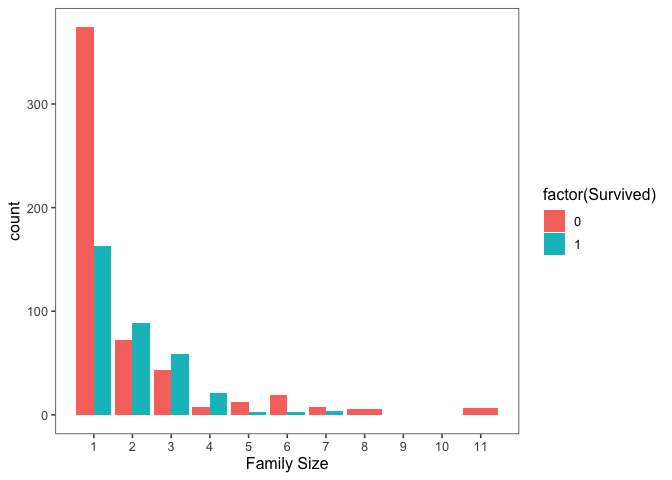
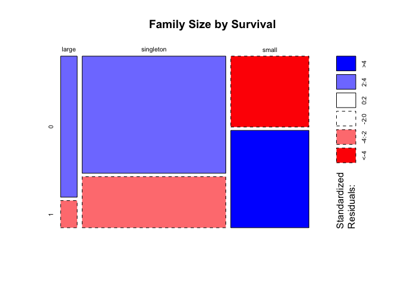
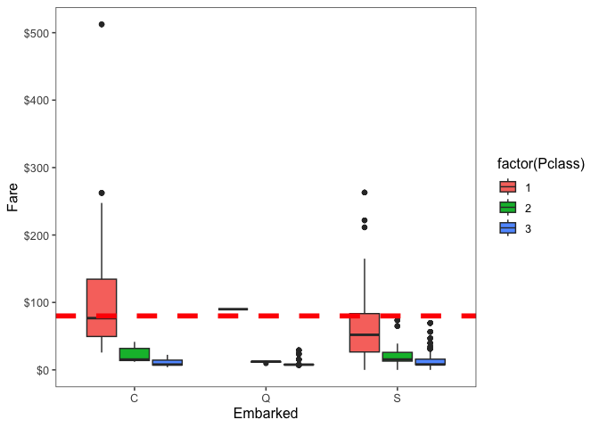
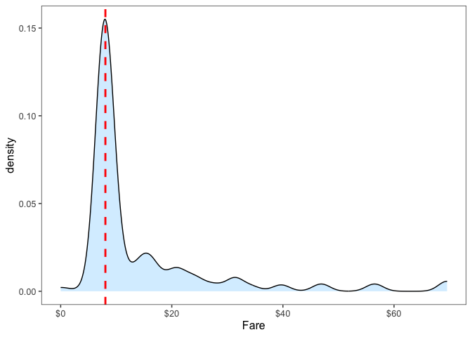
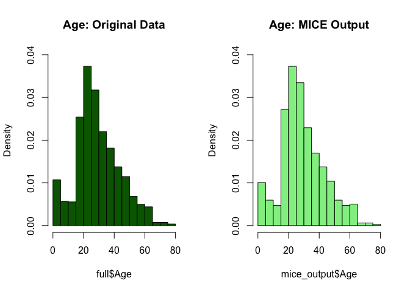
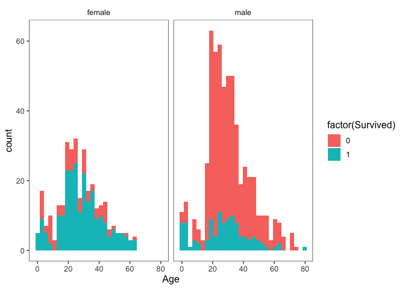
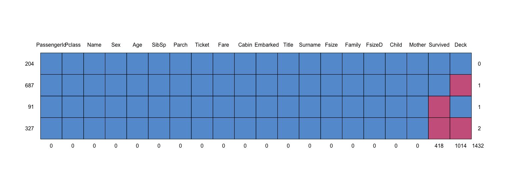
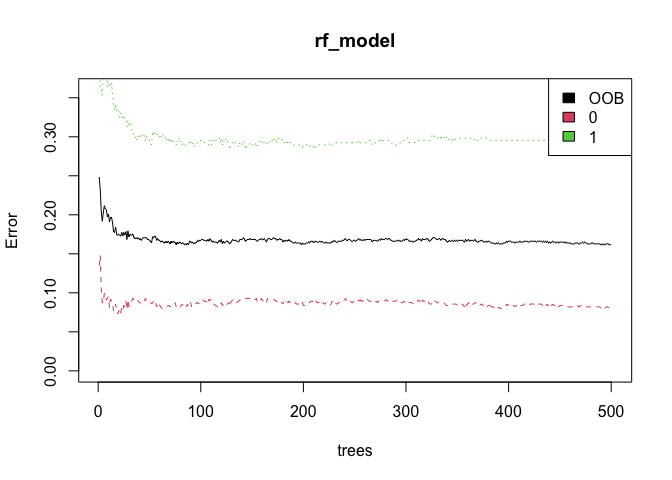
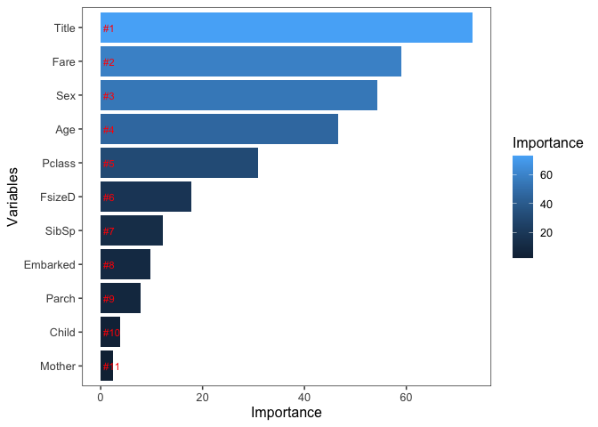

데이터마이닝및실습_과제1
================
202001733_서정민
21 November 2024

- [1. Introduction](#1-introduction)
  - [1.1 Load library & data](#11-load-library--data)
  - [1.2 Check data](#12-check-data)
- [2. Feature Engineering](#2-feature-engineering)
  - [2.1 Name](#21-name)
  - [2.2 Do families sink or swim
    together?](#22-do-families-sink-or-swim-together)
  - [2.3 Cabin](#23-cabin)
- [3.Missingness](#3missingness)
  - [3.1 Sensible value imputation](#31-sensible-value-imputation)
    - [3.1.1 Embarked](#311-embarked)
    - [3.1.2 Fare](#312-fare)
  - [3.2 Predictive imputation](#32-predictive-imputation)
    - [3.2.1 Age](#321-age)
  - [3.3 Feature Engineering : Round
    2](#33-feature-engineering--round-2)
- [4. Prediction](#4-prediction)
  - [4.1 Split into training & test
    sets](#41-split-into-training--test-sets)
  - [4.2 Building the model](#42-building-the-model)
  - [4.3 Variable importance](#43-variable-importance)
  - [4.4 Prediction](#44-prediction)

# 1. Introduction

## 1.1 Load library & data

``` r
library('ggplot2')
library('ggthemes')
library('scales')
library('dplyr')
```

    ## 
    ## Attaching package: 'dplyr'

    ## The following objects are masked from 'package:stats':
    ## 
    ##     filter, lag

    ## The following objects are masked from 'package:base':
    ## 
    ##     intersect, setdiff, setequal, union

``` r
library('mice')
```

    ## 
    ## Attaching package: 'mice'

    ## The following object is masked from 'package:stats':
    ## 
    ##     filter

    ## The following objects are masked from 'package:base':
    ## 
    ##     cbind, rbind

``` r
library('randomForest')
```

    ## randomForest 4.7-1.2

    ## Type rfNews() to see new features/changes/bug fixes.

    ## 
    ## Attaching package: 'randomForest'

    ## The following object is masked from 'package:dplyr':
    ## 
    ##     combine

    ## The following object is masked from 'package:ggplot2':
    ## 
    ##     margin

``` r
train <- read.csv('/Users/seojeongmin/Desktop/GitHub/Exploring Survival on the Titanic_Using R/train.csv', stringsAsFactors = F)
test  <- read.csv('/Users/seojeongmin/Desktop/GitHub/Exploring Survival on the Titanic_Using R/test.csv', stringsAsFactors = F)

full  <- bind_rows(train, test) # training & test data 병합하기
```

## 1.2 Check data

``` r
# 데이터 개수 확인
nrow(train)
```

    ## [1] 891

``` r
nrow(test)
```

    ## [1] 418

``` r
nrow(full)
```

    ## [1] 1309

``` r
str(full)
```

    ## 'data.frame':    1309 obs. of  12 variables:
    ##  $ PassengerId: int  1 2 3 4 5 6 7 8 9 10 ...
    ##  $ Survived   : int  0 1 1 1 0 0 0 0 1 1 ...
    ##  $ Pclass     : int  3 1 3 1 3 3 1 3 3 2 ...
    ##  $ Name       : chr  "Braund, Mr. Owen Harris" "Cumings, Mrs. John Bradley (Florence Briggs Thayer)" "Heikkinen, Miss. Laina" "Futrelle, Mrs. Jacques Heath (Lily May Peel)" ...
    ##  $ Sex        : chr  "male" "female" "female" "female" ...
    ##  $ Age        : num  22 38 26 35 35 NA 54 2 27 14 ...
    ##  $ SibSp      : int  1 1 0 1 0 0 0 3 0 1 ...
    ##  $ Parch      : int  0 0 0 0 0 0 0 1 2 0 ...
    ##  $ Ticket     : chr  "A/5 21171" "PC 17599" "STON/O2. 3101282" "113803" ...
    ##  $ Fare       : num  7.25 71.28 7.92 53.1 8.05 ...
    ##  $ Cabin      : chr  "" "C85" "" "C123" ...
    ##  $ Embarked   : chr  "S" "C" "S" "S" ...

``` r
head(full)
```

<div data-pagedtable="false">

<script data-pagedtable-source type="application/json">
{"columns":[{"label":[""],"name":["_rn_"],"type":[""],"align":["left"]},{"label":["PassengerId"],"name":[1],"type":["int"],"align":["right"]},{"label":["Survived"],"name":[2],"type":["int"],"align":["right"]},{"label":["Pclass"],"name":[3],"type":["int"],"align":["right"]},{"label":["Name"],"name":[4],"type":["chr"],"align":["left"]},{"label":["Sex"],"name":[5],"type":["chr"],"align":["left"]},{"label":["Age"],"name":[6],"type":["dbl"],"align":["right"]},{"label":["SibSp"],"name":[7],"type":["int"],"align":["right"]},{"label":["Parch"],"name":[8],"type":["int"],"align":["right"]},{"label":["Ticket"],"name":[9],"type":["chr"],"align":["left"]},{"label":["Fare"],"name":[10],"type":["dbl"],"align":["right"]},{"label":["Cabin"],"name":[11],"type":["chr"],"align":["left"]},{"label":["Embarked"],"name":[12],"type":["chr"],"align":["left"]}],"data":[{"1":"1","2":"0","3":"3","4":"Braund, Mr. Owen Harris","5":"male","6":"22","7":"1","8":"0","9":"A/5 21171","10":"7.2500","11":"","12":"S","_rn_":"1"},{"1":"2","2":"1","3":"1","4":"Cumings, Mrs. John Bradley (Florence Briggs Thayer)","5":"female","6":"38","7":"1","8":"0","9":"PC 17599","10":"71.2833","11":"C85","12":"C","_rn_":"2"},{"1":"3","2":"1","3":"3","4":"Heikkinen, Miss. Laina","5":"female","6":"26","7":"0","8":"0","9":"STON/O2. 3101282","10":"7.9250","11":"","12":"S","_rn_":"3"},{"1":"4","2":"1","3":"1","4":"Futrelle, Mrs. Jacques Heath (Lily May Peel)","5":"female","6":"35","7":"1","8":"0","9":"113803","10":"53.1000","11":"C123","12":"S","_rn_":"4"},{"1":"5","2":"0","3":"3","4":"Allen, Mr. William Henry","5":"male","6":"35","7":"0","8":"0","9":"373450","10":"8.0500","11":"","12":"S","_rn_":"5"},{"1":"6","2":"0","3":"3","4":"Moran, Mr. James","5":"male","6":"NA","7":"0","8":"0","9":"330877","10":"8.4583","11":"","12":"Q","_rn_":"6"}],"options":{"columns":{"min":{},"max":[10]},"rows":{"min":[10],"max":[10]},"pages":{}}}
  </script>

</div>

``` r
# 수치형 변수들 중 결측치 확인
colSums(is.na(full))
```

    ## PassengerId    Survived      Pclass        Name         Sex         Age 
    ##           0         418           0           0           0         263 
    ##       SibSp       Parch      Ticket        Fare       Cabin    Embarked 
    ##           0           0           0           1           0           0

``` markdown
"Survived", "Age", "Fare" 변수에서 결측치가 존재함을 알 수 있음.
"Survived"의 결측치는 test 데이터에 해당함.
```

``` r
# 문자열 변수중 결측치(공백) 확인
string_vars <- sapply(full, is.character)

sapply(names(full)[string_vars], function(col) {
  sum(full[[col]] == "" | full[[col]] == " ", na.rm = TRUE)
})
```

    ##     Name      Sex   Ticket    Cabin Embarked 
    ##        0        0        0     1014        2

``` markdown
"Cabin", "Embarked" 변수에서 결측치가 존재함을 알 수 있음.
```

``` r
summary(full)
```

    ##   PassengerId      Survived          Pclass          Name          
    ##  Min.   :   1   Min.   :0.0000   Min.   :1.000   Length:1309       
    ##  1st Qu.: 328   1st Qu.:0.0000   1st Qu.:2.000   Class :character  
    ##  Median : 655   Median :0.0000   Median :3.000   Mode  :character  
    ##  Mean   : 655   Mean   :0.3838   Mean   :2.295                     
    ##  3rd Qu.: 982   3rd Qu.:1.0000   3rd Qu.:3.000                     
    ##  Max.   :1309   Max.   :1.0000   Max.   :3.000                     
    ##                 NA's   :418                                        
    ##      Sex                 Age            SibSp            Parch      
    ##  Length:1309        Min.   : 0.17   Min.   :0.0000   Min.   :0.000  
    ##  Class :character   1st Qu.:21.00   1st Qu.:0.0000   1st Qu.:0.000  
    ##  Mode  :character   Median :28.00   Median :0.0000   Median :0.000  
    ##                     Mean   :29.88   Mean   :0.4989   Mean   :0.385  
    ##                     3rd Qu.:39.00   3rd Qu.:1.0000   3rd Qu.:0.000  
    ##                     Max.   :80.00   Max.   :8.0000   Max.   :9.000  
    ##                     NA's   :263                                     
    ##     Ticket               Fare            Cabin             Embarked        
    ##  Length:1309        Min.   :  0.000   Length:1309        Length:1309       
    ##  Class :character   1st Qu.:  7.896   Class :character   Class :character  
    ##  Mode  :character   Median : 14.454   Mode  :character   Mode  :character  
    ##                     Mean   : 33.295                                        
    ##                     3rd Qu.: 31.275                                        
    ##                     Max.   :512.329                                        
    ##                     NA's   :1

# 2. Feature Engineering

## 2.1 Name

``` r
# 승객 이름에서 호칭(Title) 추출 및 새로운 열로 저장
full$Title <- gsub('(.*, )|(\\..*)', '', full$Name)

# 성별(Sex)과 호칭(Title) 간의 관계를 빈도 테이블로 요약
table(full$Sex, full$Title)
```

    ##         
    ##          Capt Col Don Dona  Dr Jonkheer Lady Major Master Miss Mlle Mme  Mr Mrs
    ##   female    0   0   0    1   1        0    1     0      0  260    2   1   0 197
    ##   male      1   4   1    0   7        1    0     2     61    0    0   0 757   0
    ##         
    ##           Ms Rev Sir the Countess
    ##   female   2   0   0            1
    ##   male     0   8   1            0

``` r
# 희귀한 호칭을 하나의 카테고리(rare_title)로 정의
rare_title <- c('Dona', 'Lady', 'the Countess','Capt', 'Col', 'Don', 
                'Dr', 'Major', 'Rev', 'Sir', 'Jonkheer')

# mlle, ms, and mme 호칭 재할당 및  rare_title 목록에 포함된 호칭은 모두 'Rare Title'로 통합
full$Title[full$Title == 'Mlle']        <- 'Miss' 
full$Title[full$Title == 'Ms']          <- 'Miss'
full$Title[full$Title == 'Mme']         <- 'Mrs' 
full$Title[full$Title %in% rare_title]  <- 'Rare Title'

# 성별별 호칭 분포 확인
table(full$Sex, full$Title)
```

    ##         
    ##          Master Miss  Mr Mrs Rare Title
    ##   female      0  264   0 198          4
    ##   male       61    0 757   0         25

``` r
# full$Name 열에서 승객 이름 데이터로부터 성을 추출하여 새로운 열 Surname에 저장
full$Surname <- sapply(full$Name,  
                      function(x) strsplit(x, split = '[,.]')[[1]][1])
```

``` r
# 고유 성(Surname) 개수를 계산하여 출력
cat(paste('We have', nlevels(factor(full$Surname)), 'unique surnames. I would be interested to infer ethnicity based on surname --- another time.'))
```

    ## We have 875 unique surnames. I would be interested to infer ethnicity based on surname --- another time.

## 2.2 Do families sink or swim together?

``` r
# Fsize = SibSp(형제자매와 배우자의수) + Parch(부모와 자녀의수) + 1로 가족 크기 변수 생성
# Fsize를 사용하여 가족 크기와 생존율 간의 관계를 분석하기 위해
full$Fsize <- full$SibSp + full$Parch + 1

# Surname(성)과 Fsize(가족 크기)를 결합하여 새로운 Family 변수 생성
# Family를 통해 같은 성과 가족 크기를 공유하는 승객을 그룹화하여 특정 가족의 생존율이나 행동 패턴을 분석하기 위해
full$Family <- paste(full$Surname, full$Fsize, sep='_')
```

``` r
# 가족 크기(Fsize)와 생존 여부(Survived) 간의 관계 분석 및 막대그래프로 시각화
ggplot(full[1:891,], aes(x = Fsize, fill = factor(Survived))) +
  geom_bar(stat='count', position='dodge') +
  scale_x_continuous(breaks=c(1:11)) +
  labs(x = 'Family Size') +
  theme_few()
```

<!-- -->

``` markdown
Fsize = 1 : 생존확률 낮음
Fsize = 2~4 : 생존확률 높음
Fsize > 4 :생존확률 낮음, 특히 가족 크기가 6 이상일 때, 생존 가능성이 급격히 낮아지는 경향을 보임.
```

``` r
# 가족 크기 범주화
full$FsizeD[full$Fsize == 1] <- 'singleton'
full$FsizeD[full$Fsize < 5 & full$Fsize > 1] <- 'small'
full$FsizeD[full$Fsize > 4] <- 'large'

# 범주형 데이터(FsizeD)로 변환한 가족 크기와 생존률 간의 관계를 모자이크플롯으로 시각화
mosaicplot(table(full$FsizeD, full$Survived), main='Family Size by Survival', shade=TRUE)
```

<!-- -->

``` markdown
생존률은 small > singleton > large 순으로 높다.
```

## 2.3 Cabin

``` r
# 결측치가 많은 Cabin 변수의 첫 28개의 값을 확인하기(빠르게 샘플링하여 결측치와 패턴을 확인하기 위해)
full$Cabin[1:28]
```

    ##  [1] ""            "C85"         ""            "C123"        ""           
    ##  [6] ""            "E46"         ""            ""            ""           
    ## [11] "G6"          "C103"        ""            ""            ""           
    ## [16] ""            ""            ""            ""            ""           
    ## [21] ""            "D56"         ""            "A6"          ""           
    ## [26] ""            ""            "C23 C25 C27"

``` r
# (full$Cabin[2])에서 문자열을 개별 문자 단위로 분리
strsplit(full$Cabin[2], NULL)[[1]]
```

    ## [1] "C" "8" "5"

``` markdown
선실 번호(Cabin)의 첫 문자(선실 구역, Deck), 선실 번호의 첫번째 자리, 선실번호의 두번째 자리로 분리
이는 승객의 사회적 지위, 티켓 클래스, 또는 생존 가능성과 밀접하게 관련될 수 있다.
```

``` r
# 새로운 변수 Deck을 생성하여, 승객이 위치한 선실 구역(Deck) 정보를 추출
# 각 선실의 첫 번째 문자(A부터 F)를 기반으로 구역을 구분
full$Deck<-factor(sapply(full$Cabin, function(x) strsplit(x, NULL)[[1]][1]))
```

``` r
# 추가한 변수들이 full data에 잘 입력되었는지 확인하기
head(full)
```

<div data-pagedtable="false">

<script data-pagedtable-source type="application/json">
{"columns":[{"label":[""],"name":["_rn_"],"type":[""],"align":["left"]},{"label":["PassengerId"],"name":[1],"type":["int"],"align":["right"]},{"label":["Survived"],"name":[2],"type":["int"],"align":["right"]},{"label":["Pclass"],"name":[3],"type":["int"],"align":["right"]},{"label":["Name"],"name":[4],"type":["chr"],"align":["left"]},{"label":["Sex"],"name":[5],"type":["chr"],"align":["left"]},{"label":["Age"],"name":[6],"type":["dbl"],"align":["right"]},{"label":["SibSp"],"name":[7],"type":["int"],"align":["right"]},{"label":["Parch"],"name":[8],"type":["int"],"align":["right"]},{"label":["Ticket"],"name":[9],"type":["chr"],"align":["left"]},{"label":["Fare"],"name":[10],"type":["dbl"],"align":["right"]},{"label":["Cabin"],"name":[11],"type":["chr"],"align":["left"]},{"label":["Embarked"],"name":[12],"type":["chr"],"align":["left"]},{"label":["Title"],"name":[13],"type":["chr"],"align":["left"]},{"label":["Surname"],"name":[14],"type":["chr"],"align":["left"]},{"label":["Fsize"],"name":[15],"type":["dbl"],"align":["right"]},{"label":["Family"],"name":[16],"type":["chr"],"align":["left"]},{"label":["FsizeD"],"name":[17],"type":["chr"],"align":["left"]},{"label":["Deck"],"name":[18],"type":["fct"],"align":["left"]}],"data":[{"1":"1","2":"0","3":"3","4":"Braund, Mr. Owen Harris","5":"male","6":"22","7":"1","8":"0","9":"A/5 21171","10":"7.2500","11":"","12":"S","13":"Mr","14":"Braund","15":"2","16":"Braund_2","17":"small","18":"NA","_rn_":"1"},{"1":"2","2":"1","3":"1","4":"Cumings, Mrs. John Bradley (Florence Briggs Thayer)","5":"female","6":"38","7":"1","8":"0","9":"PC 17599","10":"71.2833","11":"C85","12":"C","13":"Mrs","14":"Cumings","15":"2","16":"Cumings_2","17":"small","18":"C","_rn_":"2"},{"1":"3","2":"1","3":"3","4":"Heikkinen, Miss. Laina","5":"female","6":"26","7":"0","8":"0","9":"STON/O2. 3101282","10":"7.9250","11":"","12":"S","13":"Miss","14":"Heikkinen","15":"1","16":"Heikkinen_1","17":"singleton","18":"NA","_rn_":"3"},{"1":"4","2":"1","3":"1","4":"Futrelle, Mrs. Jacques Heath (Lily May Peel)","5":"female","6":"35","7":"1","8":"0","9":"113803","10":"53.1000","11":"C123","12":"S","13":"Mrs","14":"Futrelle","15":"2","16":"Futrelle_2","17":"small","18":"C","_rn_":"4"},{"1":"5","2":"0","3":"3","4":"Allen, Mr. William Henry","5":"male","6":"35","7":"0","8":"0","9":"373450","10":"8.0500","11":"","12":"S","13":"Mr","14":"Allen","15":"1","16":"Allen_1","17":"singleton","18":"NA","_rn_":"5"},{"1":"6","2":"0","3":"3","4":"Moran, Mr. James","5":"male","6":"NA","7":"0","8":"0","9":"330877","10":"8.4583","11":"","12":"Q","13":"Mr","14":"Moran","15":"1","16":"Moran_1","17":"singleton","18":"NA","_rn_":"6"}],"options":{"columns":{"min":{},"max":[10]},"rows":{"min":[10],"max":[10]},"pages":{}}}
  </script>

</div>

# 3.Missingness

## 3.1 Sensible value imputation

### 3.1.1 Embarked

``` r
# Embarked에서 결측치 또는 빈 문자열 확인
which(is.na(full$Embarked) | full$Embarked == "")
```

    ## [1]  62 830

``` markdown
승객 62와 830의 Embarkment가 결측 되었음을 알 수 있다.
```

``` r
# Passengers 62 and 830 are missing Embarkment
full[c(62, 830), 'Embarked']
```

    ## [1] "" ""

``` r
cat(paste(
  'We will infer their values for embarkment based on present data that we can imagine may be relevant: passenger class and fare. We see that they paid $', full[62, 'Fare'], 'and $', full[830, 'Fare'], 'respectively and their classes are', full[62, 'Pclass'], 'and', full[830, 'Pclass'], '. So from where did they embark?'))
```

    ## We will infer their values for embarkment based on present data that we can imagine may be relevant: passenger class and fare. We see that they paid $ 80 and $ 80 respectively and their classes are 1 and 1 . So from where did they embark?

``` markdown
62번과 830번 승객의 Fare(운임)과 Pclass(승객 클래스)를 기반으로, 그들이 어디서 탑승했는지(Embarked)를 추론하기 위한 정보를 출력
62번과 830번 승객의 Fare가 $80이고, Pclass는 1st class 이다.
```

``` r
full[c(62, 830), c('Fare', 'Pclass')]
```

<div data-pagedtable="false">

<script data-pagedtable-source type="application/json">
{"columns":[{"label":[""],"name":["_rn_"],"type":[""],"align":["left"]},{"label":["Fare"],"name":[1],"type":["dbl"],"align":["right"]},{"label":["Pclass"],"name":[2],"type":["int"],"align":["right"]}],"data":[{"1":"80","2":"1","_rn_":"62"},{"1":"80","2":"1","_rn_":"830"}],"options":{"columns":{"min":{},"max":[10]},"rows":{"min":[10],"max":[10]},"pages":{}}}
  </script>

</div>

``` r
# 결측치가 있는 승객 제외(ID가 62, 830인 승객)
embark_fare <- full %>%
  filter(PassengerId != 62 & PassengerId != 830)

# ggplot2를 이용하여 탑승 항구(Embarked), 승객 클래스(Pclass), 및 운임(Fare) 간의 관계를 시각화
ggplot(embark_fare, aes(x = Embarked, y = Fare, fill = factor(Pclass))) +
  geom_boxplot() +
  geom_hline(aes(yintercept=80), 
    colour='red', linetype='dashed', lwd=2) +
  scale_y_continuous(labels=dollar_format()) +
  theme_few()
```

    ## Warning: Removed 1 row containing non-finite outside the scale range
    ## (`stat_boxplot()`).

<!-- -->

``` markdown
탑승 항구별 승객 패턴:
- C (Cherbourg) : 1등석 승객들의 운임이 높으며, 대부분 $80 이상의 운임을 지불함.
- Q (Queenstown): 3등석 승객의 운임이 매우 낮음.
- S (Southampton): 모든 클래스의 승객이 분포하며, 운임 범위는 다양함.
```

``` markdown
 62번과 830번 승객의 Embarked 값 추론:
두 승객은 $80의 운임을 지불했으며, 이는 C (Cherbourg) 항구에서 1등석(Pclass 1) 승객에게 주로 나타나는 값이다.
따라서, 이 승객들의 Embarked 값을 C로 대체하는 것이 타당하다.
```

``` r
# 62번과 830번 승객의 Embarked 결측치를 ‘C’(Cherbourg)로 대체하기
full$Embarked[c(62, 830)] <- 'C'
```

### 3.1.2 Fare

``` r
# Fare 열에서 결측치가 포함된 행 번호 확인
which(is.na(full$Fare))
```

    ## [1] 1044

``` r
# 1044번 행 출력
full[1044, ]
```

<div data-pagedtable="false">

<script data-pagedtable-source type="application/json">
{"columns":[{"label":[""],"name":["_rn_"],"type":[""],"align":["left"]},{"label":["PassengerId"],"name":[1],"type":["int"],"align":["right"]},{"label":["Survived"],"name":[2],"type":["int"],"align":["right"]},{"label":["Pclass"],"name":[3],"type":["int"],"align":["right"]},{"label":["Name"],"name":[4],"type":["chr"],"align":["left"]},{"label":["Sex"],"name":[5],"type":["chr"],"align":["left"]},{"label":["Age"],"name":[6],"type":["dbl"],"align":["right"]},{"label":["SibSp"],"name":[7],"type":["int"],"align":["right"]},{"label":["Parch"],"name":[8],"type":["int"],"align":["right"]},{"label":["Ticket"],"name":[9],"type":["chr"],"align":["left"]},{"label":["Fare"],"name":[10],"type":["dbl"],"align":["right"]},{"label":["Cabin"],"name":[11],"type":["chr"],"align":["left"]},{"label":["Embarked"],"name":[12],"type":["chr"],"align":["left"]},{"label":["Title"],"name":[13],"type":["chr"],"align":["left"]},{"label":["Surname"],"name":[14],"type":["chr"],"align":["left"]},{"label":["Fsize"],"name":[15],"type":["dbl"],"align":["right"]},{"label":["Family"],"name":[16],"type":["chr"],"align":["left"]},{"label":["FsizeD"],"name":[17],"type":["chr"],"align":["left"]},{"label":["Deck"],"name":[18],"type":["fct"],"align":["left"]}],"data":[{"1":"1044","2":"NA","3":"3","4":"Storey, Mr. Thomas","5":"male","6":"60.5","7":"0","8":"0","9":"3701","10":"NA","11":"","12":"S","13":"Mr","14":"Storey","15":"1","16":"Storey_1","17":"singleton","18":"NA","_rn_":"1044"}],"options":{"columns":{"min":{},"max":[10]},"rows":{"min":[10],"max":[10]},"pages":{}}}
  </script>

</div>

``` r
# 3등석(Pclass == '3') 승객 중 Southampton(Embarked == 'S')에서 탑승한 승객들의 운임(Fare) 분포를 밀도 그래프로 시각화
ggplot(full[full$Pclass == '3' & full$Embarked == 'S', ], 
  aes(x = Fare)) +
  geom_density(fill = '#99d6ff', alpha=0.4) + 
  geom_vline(aes(xintercept=median(Fare, na.rm=T)),
    colour='red', linetype='dashed', lwd=1) +
  scale_x_continuous(labels=dollar_format()) +
  theme_few()
```

    ## Warning: Removed 1 row containing non-finite outside the scale range
    ## (`stat_density()`).

<!-- -->

``` markdown
그래프의 밀도(Density)가 가장 높은 부분은 약 $7 근처로 나타난다.
이는 3등석 승객들 중 다수가 $7.25 정도의 운임을 지불했다는 것을 보여준다.
```

``` r
# 1044번 승객의 Fare 결측치를 Pclass=3 승객 중 Embarked=S 에서 탑승한 승객들의 운임 중앙값을 대체
full$Fare[1044] <- median(full[full$Pclass == '3' & full$Embarked == 'S', ]$Fare, na.rm = TRUE)
```

## 3.2 Predictive imputation

### 3.2.1 Age

``` r
sum(is.na(full$Age))
```

    ## [1] 263

``` markdown
Age 변수의 결측치의 개수가 263개이다.
```

``` r
# 특정 변수들을 범주형(factor)으로 변환
factor_vars <- c('PassengerId','Pclass','Sex','Embarked',
                 'Title','Surname','Family','FsizeD')

full[factor_vars] <- lapply(full[factor_vars], function(x) as.factor(x))

# 랜덤 시드 설정
set.seed(129)

# mice 함수를 통한 다중 대체 수행(분석에 크게 기여하지 않는 변수들은 제외)
mice_mod <- mice(full[, !names(full) %in% c('PassengerId','Name','Ticket','Cabin','Family','Surname','Survived')], method='rf') 
```

    ## 
    ##  iter imp variable
    ##   1   1  Age  Deck
    ##   1   2  Age  Deck
    ##   1   3  Age  Deck
    ##   1   4  Age  Deck
    ##   1   5  Age  Deck
    ##   2   1  Age  Deck
    ##   2   2  Age  Deck
    ##   2   3  Age  Deck
    ##   2   4  Age  Deck
    ##   2   5  Age  Deck
    ##   3   1  Age  Deck
    ##   3   2  Age  Deck
    ##   3   3  Age  Deck
    ##   3   4  Age  Deck
    ##   3   5  Age  Deck
    ##   4   1  Age  Deck
    ##   4   2  Age  Deck
    ##   4   3  Age  Deck
    ##   4   4  Age  Deck
    ##   4   5  Age  Deck
    ##   5   1  Age  Deck
    ##   5   2  Age  Deck
    ##   5   3  Age  Deck
    ##   5   4  Age  Deck
    ##   5   5  Age  Deck

    ## Warning: Number of logged events: 50

``` markdown
- mice 알고리즘에서 범주형 변수는 특별히 처리되므로, 적절한 데이터 타입으로 변환이 필요하다.
- 제외된 변수들은 결측치 대체 과정에서 분석에 기여하지 않거나, 대체에 적합하지 않은 변수이다.
```

``` r
# 결측치가 대체된 최종 데이터 저장
mice_output <- complete(mice_mod)
```

``` r
# 결측치 대체 전후의 Age 변수 분포 비교
par(mfrow=c(1,2))
hist(full$Age, freq=F, main='Age: Original Data', 
  col='darkgreen', ylim=c(0,0.04))
hist(mice_output$Age, freq=F, main='Age: MICE Output', 
  col='lightgreen', ylim=c(0,0.04))
```

<!-- -->

``` markdown
두 히스토그램을 비교한 결과, 대체 후 데이터의 분포가 원본 데이터의 분포와 유사함을 알 수 있다.
```

``` r
# mice model로 대체된 Age 데이터 적용
full$Age <- mice_output$Age

# Age 변수의 결측치 확인
sum(is.na(full$Age))
```

    ## [1] 0

## 3.3 Feature Engineering : Round 2

``` r
# 연령(Age)과 생존(Survived) 간의 관계를 시각적으로 탐색하며, 성별(Sex)에 따른 차이를 분석
ggplot(full[1:891,], aes(Age, fill = factor(Survived))) + 
  geom_histogram() + 
  #성별(Sex)이 생존율(Survived)을 예측하는 데 중요한 요인으로 사전에 알려져 있기 때문에 분석에 포함
  facet_grid(.~Sex) + 
  theme_few()
```

    ## `stat_bin()` using `bins = 30`. Pick better value with `binwidth`.

<!-- -->

``` markdown
- 여성 (female): 대부분 생존(파란색), 특히 어린이와 성인 여성에서 생존율이 높음.
- 남성 (male): 대부분 사망(빨간색), 어린 연령대(0~10세)에서만 생존율이 상대적으로 높음.
즉, 여성은 전 연령대에서 생존율이 높고, 남성은 대부분 사망.
구조 과정에서 여성과 어린이가 우선된 경향이 강하게 드러남.
```

``` r
# Child 열을 생성하여 승객을 18세 기준으로 어린이(Child)와 성인(Adult)으로 구분
full$Child[full$Age < 18] <- 'Child'
full$Child[full$Age >= 18] <- 'Adult'

# 빈도표 생성
table(full$Child, full$Survived)
```

    ##        
    ##           0   1
    ##   Adult 478 276
    ##   Child  71  66

``` markdown
어린이는 성인보다 생존율이 높음을 확인할 수 있다.
```

``` r
# Mother 변수를 생성하여 여성 승객 중 어머니(Mother)와 그렇지 않은 승객을 구분
full$Mother <- 'Not Mother'
full$Mother[full$Sex == 'female' & full$Parch > 0 & full$Age > 18 & full$Title != 'Miss'] <- 'Mother'

# 빈도표 생성
table(full$Mother, full$Survived)
```

    ##             
    ##                0   1
    ##   Mother      16  39
    ##   Not Mother 533 303

``` markdown
어머니 그룹은 높은 생존율(약 70.9%)을 보여, Titanic 구조 과정에서 어머니로 분류된 여성들이 자녀와 함께 구조되었을 가능성을 시사한다.
반면, 어머니가 아닌 승객은 생존율(36.2%)이 더 낮다.
```

``` r
# Child와 Mother 변수를 범주형(factor) 데이터로 변환
full$Child  <- factor(full$Child)
full$Mother <- factor(full$Mother)
```

``` r
md.pattern(full)
```

<!-- -->

    ##     PassengerId Pclass Name Sex Age SibSp Parch Ticket Fare Cabin Embarked
    ## 204           1      1    1   1   1     1     1      1    1     1        1
    ## 687           1      1    1   1   1     1     1      1    1     1        1
    ## 91            1      1    1   1   1     1     1      1    1     1        1
    ## 327           1      1    1   1   1     1     1      1    1     1        1
    ##               0      0    0   0   0     0     0      0    0     0        0
    ##     Title Surname Fsize Family FsizeD Child Mother Survived Deck     
    ## 204     1       1     1      1      1     1      1        1    1    0
    ## 687     1       1     1      1      1     1      1        1    0    1
    ## 91      1       1     1      1      1     1      1        0    1    1
    ## 327     1       1     1      1      1     1      1        0    0    2
    ##         0       0     0      0      0     0      0      418 1014 1432

# 4. Prediction

## 4.1 Split into training & test sets

``` r
# full 데이터를 train과 test 데이터로 분리
train <- full[1:891,]
test <- full[892:1309,]
```

## 4.2 Building the model

``` r
# 랜덤 시드 설정
set.seed(754)

# 랜덤포레스트 모델 생성 (Name, Ticket 등의 모델에 직접적으로 관련되지 않는 변수들은 제외)
rf_model <- randomForest(factor(Survived) ~ Pclass + Sex + Age + SibSp + Parch + 
                                            Fare + Embarked + Title + 
                                            FsizeD + Child + Mother,
                                            data = train)

# 오차 시각화
plot(rf_model, ylim=c(0,0.36))
legend('topright', colnames(rf_model$err.rate), col=1:3, fill=1:3)
```

<!-- -->

``` markdown
- 검정색 선 (OOB): 전체 데이터에 대한 평균 오류율.
- 빨간색 선 (0): 생존하지 않은 클래스(0)에 대한 오류율.
- 초록색 선 (1): 생존한 클래스(1)에 대한 오류율.
```

``` markdown
1. OOB 오류율:
  - 그래프에서 검정색 선(OOB 오류율)이 약 10~15% 수준에서 안정화된다.
    - 이는 모델의 전반적인 성능이 양호하며, 과적합이 없음을 나타낸다.
2. 클래스별 오류율:
    - Class 0(빨간색): 오류율이 낮고 안정적이다.
    -   Class 1(초록색): 오류율이 Class 0보다 약간 더 높다.
    -   이는 생존자의 수가 적거나 불균형 데이터로 인해 발생할 수 있다.
3. 트리 개수:
    -   트리의 수가 약 100~200개 이상부터 OOB 오류율이 안정화된다.
    -   너무 많은 트리를 추가하는 것은 학습 시간이 길어질 뿐, 성능에 큰 영향을 미치지 않는다.
```

## 4.3 Variable importance

``` r
# 변수 중요도 추출
importance    <- importance(rf_model)
varImportance <- data.frame(Variables = row.names(importance), 
                            Importance = round(importance[ ,'MeanDecreaseGini'],2))

# 중요도에 따른 순위 생성
rankImportance <- varImportance %>%
  mutate(Rank = paste0('#',dense_rank(desc(Importance))))

# 변수 중요도 시각화
ggplot(rankImportance, aes(x = reorder(Variables, Importance), 
    y = Importance, fill = Importance)) +
  geom_bar(stat='identity') + 
  geom_text(aes(x = Variables, y = 0.5, label = Rank),
    hjust=0, vjust=0.55, size = 3, colour = 'red') +
  labs(x = 'Variables') +
  coord_flip() + 
  theme_few()
```

<!-- -->

``` markdown
결과 해석
1. 상위 변수
    -   Title (#1): 가장 중요한 변수로, 승객의 직함(Mr, Mrs, Miss, 등)이 생존 여부를 강력히 예측.
    -   Fare (#2): 운임이 생존 여부에 큰 영향을 미침. 이는 부유층 승객일수록 생존 가능성이 높다는 기존 분석 결과와 일치.
    -   Sex (#3): 성별은 여성이 남성보다 생존 가능성이 높다는 사실을 반영.
    -   Age (#4): 나이도 생존에 중요한 변수로, 어린이의 생존율이 높았음을 나타냄.
2. 중간 중요도 변수
    -   Pclass (#5): 승객의 객실 등급(1등석, 2등석, 3등석)은 생존율에 상당한 영향을 미침.
    -   FsizeD (#6): 가족 크기 범주(소규모, 대규모 등)가 생존 여부와 관련.
3. 하위 변수
    - SibSp (#7): 형제/자매 동반 여부는 생존에 약한 영향을 미침.
    -   Embarked (#8): 출발 항구(C, Q, S)는 상대적으로 중요도가 낮음.
    -   Parch, Child, Mother: 부모/자녀 동반 여부, 어린이 여부, 어머니 여부는 낮은 중요도를 보임.
```

``` markdown
주요 통찰
1. Title과 Fare의 중요성:
    -   Title은 사회적 지위나 결혼 여부를 나타내며, 구조 우선순위에 반영되었을 가능성을 시사.
    -   Fare는 경제적 지위와 생존 간의 관계를 반영.
2. 성별(Sex)과 나이(Age)의 역할:
    -   여성과 어린이가 구조 우선순위에 포함되었음을 보여줌.
3. 다른 변수의 상대적 기여도:
    -   Pclass는 예상대로 중요한 변수로 나타났으나, Embarked와 같은 변수는 상대적으로 기여도가 낮음.
```

## 4.4 Prediction

``` r
# test 데이터에 대한 예측
prediction <- predict(rf_model, test)

# 예측 결과를 PassengerId와 Survived로 구성된 데이터프레임으로 저장
solution <- data.frame(PassengerID = test$PassengerId, Survived = prediction)

# csv 파일로 저장
write.csv(solution, file = '/Users/seojeongmin/Desktop/3-2/데이터마이닝및실습/titanic/rf_mod_Solution.csv', row.names = F)
```
